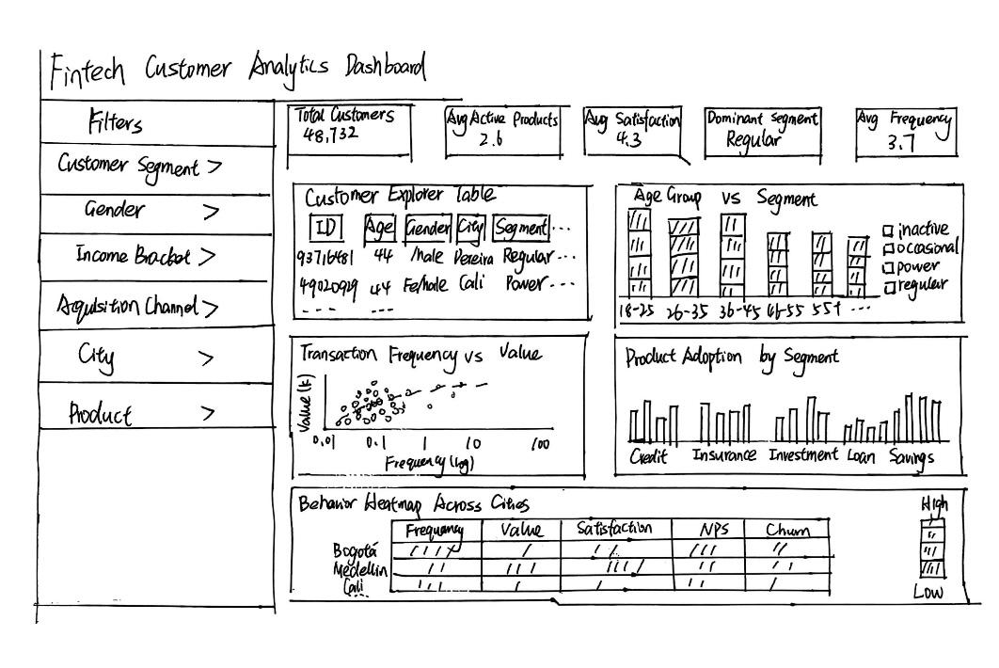

# Customer Overview & Segmentation

This page will contain the prototype, analysis, and findings for Module 1.

# 1 Introduction

## 1.1 Project Background

Fintech platforms collect large volumes of customer data related to demographics, financial product usage, and digital engagement behaviour. Analysing these data can help fintech companies understand their customer base, identify behavioural patterns, and improve customer experience. This project develops a visual analytics dashboard for a Colombian fintech customer dataset. By integrating interactive visualisations and data analytics techniques, the system enables users to explore customer demographics, product adoption, and behavioural patterns, providing insights that support data-driven decision-making for fintech product and marketing teams.

## 1.2 Project Storyline and System Architecture

The proposed fintech analytics dashboard is organised into three analytical modules that together form a coherent visual analytics workflow.The analytical process follows a progressive logic:

Customer Overview → Customer Engagement → Customer Retention & Value

This structure allows users to gradually explore the customer lifecycle, from understanding who the customers are to analysing how they interact with the platform and finally identifying high-value or high-risk customers.

### Module 1: Customer Overview & Segmentation

The first module focuses on understanding the **structure of the customer base**. It analyses demographic characteristics, geographic distribution, acquisition channels, and financial product adoption patterns.

This module answers fundamental questions such as:

• Who are the customers using the platform?\
• Which demographic groups dominate the user base?\
• Which financial products are most commonly adopted?

These insights provide the baseline understanding of the fintech customer population.

### Module 2: Customer Engagement & Experience

The second module focuses on **how customers interact with the platform**. It analyses digital engagement indicators such as application usage, feature adoption, and transaction activity.

In addition, it examines customer experience metrics including satisfaction scores, Net Promoter Score (NPS), customer feedback, and support interactions.

This module helps identify behavioural patterns and service experience issues that influence customer satisfaction.

### Module 3: Retention Risk & Customer Value

The third module focuses on **customer retention and business value**. It analyses churn probability, customer lifetime value (CLV), and transaction behaviour indicators.

The goal of this module is to identify:

• customers with high churn risk\
• customers with high lifetime value\
• high-value customers that may also be at risk

These insights help fintech companies design targeted retention and growth strategies.

Together, the three modules create a complete analytical workflow that supports data-driven decision-making for fintech product and marketing teams.

## 1.3 Module 1 Analysis Overview

This module presents the **Customer Overview and Segmentation analysis** for a Colombian fintech platform.

Understanding the structure of the customer base is critical for fintech companies because customer demographics, product adoption, and financial behaviour are closely related to customer engagement and retention.

This project aims to develop an **interactive visual analytics dashboard** that helps business teams better understand customer behaviour and make data-driven decisions.\
\
This module aims to answer the following questions:

-   Who are the customers using the fintech platform?

-   Where are the customers geographically located?

-   Which financial products are most commonly adopted?

-   How do customer demographics and product adoption vary across segments?

-   Are there distinct behavioural customer clusters?

The insights derived from this module provide the foundation for the subsequent modules focusing on **customer engagement and churn risk analysis**.

# 2 Initial Data Preparation

## 2.1 Install and Load Required Packages

```{r}
pacman::p_load(tidyverse,readxl,plotly,ggplot2,
               DT,scales,ggdist,cluster,
               heatmaply,viridis,leaflet)
```

| Package   | Purpose                    |
|-----------|----------------------------|
| tidyverse | data manipulation          |
| readxl    | data import                |
| ggplot2   | visualisation              |
| plotly    | interactive charts         |
| leaflet   | spatial mapping            |
| DT        | interactive tables         |
| heatmaply | clustering heatmaps        |
| ggdist    | distribution visualisation |

```{r}
customer_data <- read_excel("customer_data.xlsx")
```

Inspect the dataset structure:

```{r}
glimpse(customer_data)
```

The dataset contains:

-   **48,723 customers**

-   **57 variables**

Variables include:

-   demographic attributes

-   geographic location

-   financial product ownership

-   digital engagement behaviour

-   transaction activity

-   customer lifetime value

-   churn probability

# 3 Data Wrangling

## 3.1 Convert Data Types

Categorical variables are converted to factors to ensure correct handling in statistical analysis and visualisation.

```{r}
customer_data <- customer_data %>%
mutate(
gender = as.factor(gender),
customer_segment = as.factor(customer_segment),
acquisition_channel = as.factor(acquisition_channel),
income_bracket = as.factor(income_bracket),
city = as.factor(city))
```

## 3.2 Create Age Groups

Customers are grouped into meaningful age segments to facilitate demographic analysis.

```{r}
customer_data <- customer_data %>%

mutate( age_group = cut(
         age,breaks = c(18,25,35,45,55,70),
             labels = c("18-25","26-35","36-45","46-55","55+")))
```

These age groups allow the analysis of customer segmentation patterns across different life stages.

## 3.3 Validate Geographic Coordinates

Customer geographic coordinates are validated to ensure they can be used in spatial visualisation.

```{r}
summary(customer_data$latitude)
summary(customer_data$longitude)
```

These coordinates will be used for spatial visualisation.

## 3.4 Create Active Products Variable

A derived variable named active_products is created to represent the total number of financial products owned by each customer.

```{r}
customer_data <- customer_data %>%
mutate(
active_products =
savings_account +
credit_card +
personal_loan +
investment_account +
insurance_product
)
```

This variable provides a measure of customer financial engagement on the platform.

# 4 Exploratory Visual Analytics

## 4.1 Interactive Customer Explorer Table

The interactive table enables dynamic exploration of customer profiles and supports filtering across demographic and financial attributes.

```{r}
#| echo: true
#| code-fold: true
#| code-summary: "Show the code"
customer_overview <- customer_data %>%
select(customer_id,age,gender,city,
       income_bracket,occupation,education_level,
       marital_status,acquisition_channel,customer_segment,
       active_products,savings_account,credit_card,
       personal_loan,investment_account,insurance_product)

datatable(customer_overview,
          filter = "top",extensions = "Buttons",
          options = list(pageLength = 10,
                         scrollX = TRUE,
                         dom = "Bfrtip",
                         buttons = c("copy","csv","excel")))
```

This table provides an overview of the customer population and enables flexible filtering across demographic and financial attributes.

## 4.2 Customer Segment Distribution by Age Group

This visualisation shows how customer segments are distributed across age groups using a stacked bar chart, revealing which segments dominate each life stage.

```{r}
#| echo: true
#| code-fold: true
#| code-summary: "Show the code"
age_segment <- customer_data %>%
  filter(!is.na(age_group)) %>%
  count(age_group, customer_segment) %>%
  group_by(age_group) %>%
  mutate(pct = n / sum(n))
p_age_seg <- ggplot(age_segment,
       aes(x = age_group,
           y = pct,
           fill = customer_segment)) +
  geom_bar(stat = "identity",
           position = "stack",
           colour = "#2C3E50",
           linewidth = 0.2) +
  scale_y_continuous(labels = percent_format()) +
  scale_fill_manual(values = c("inactive"   = "#95A5A6",
                               "occasional" = "#3498DB",
                               "power"      = "#E67E22",
                               "regular"    = "#2ECC71")) +
  labs(title = "Customer Segment Distribution by Age Group",
       x     = "Age Group",
       y     = "Proportion of Customers",
       fill  = "Customer Segment") +
  theme_minimal() +
  theme(plot.title = element_text(size = 14, face = "bold"))
ggplotly(p_age_seg, height = 450)
```

The stacked bar chart reveals how the composition of customer segments shifts across age groups, helping identify which life stages are dominated by active power users versus inactive or occasional customers.

## 4.3 Transaction Frequency by Age Group and Segment

This boxplot compares transaction frequency across age groups and customer segments, helping identify whether engagement differences are driven by age or segment type.

```{r}
#| echo: true
#| code-fold: true
#| code-summary: "Show the code"
p_txfreq <- ggplot(customer_data,
       aes(x = age_group,
           y = transaction_frequency,
           fill = customer_segment)) +
  geom_boxplot(alpha = 0.7,
               position = position_dodge(0.8)) +
  scale_y_log10() +
  scale_fill_manual(values = c("inactive"   = "#95A5A6",
                               "occasional" = "#3498DB",
                               "power"      = "#E67E22",
                               "regular"    = "#2ECC71")) +
  labs(title = "Transaction Frequency by Age Group and Segment",
       x     = "Age Group",
       y     = "Transaction Frequency (log scale)",
       fill  = "Customer Segment") +
  theme_minimal() +
  theme(plot.title = element_text(size = 14, face = "bold"))

ggplotly(p_txfreq, height = 450)
```

Customer engagement level (segment) appears to have a stronger influence on transaction behaviour than age alone. Power users consistently show higher transaction frequency across all age groups, while inactive users remain low regardless of age. The log scale adjusts for the heavily right-skewed distribution.

## 4.4 Customer Behaviour Analysis

The scatter plot helps identify behavioural patterns among customer segments, particularly high-value users who demonstrate both high transaction frequency and high transaction value.

```{r}
#| echo: true
#| code-fold: true
#| code-summary: "Show the code"

set.seed(123)
sample_data <- customer_data %>%
  sample_n(5000)
p_scatter <- ggplot(sample_data,
                    aes(x = transaction_frequency,
                        y = average_transaction_value / 1000,
                        color = customer_segment)) +
  geom_point(alpha = 0.4,size = 1.5) +
  geom_smooth(method = "lm",se = FALSE,color = "#2C3E50",linewidth = 1) +
  scale_x_log10() +
  scale_color_manual(values = c("inactive" = "#95A5A6",
                                "occasional" = "#3498DB",
                                "regular" = "#2ECC71",
                                "power" = "#E67E22")) +
  labs(title = "Customer Behaviour: Transaction Frequency vs Transaction Value",
       x = "Transaction Frequency (log scale)",
       y = "Average Transaction Value (Thousands)",
       color = "Customer Segment") +
  theme_minimal() +
  theme(plot.title = element_text(size = 14, face = "bold"),
        legend.position = "right")
ggplotly(p_scatter, height = 450)
```

The visualisation helps identify behavioural differences in spending patterns.\
Customers with higher transaction frequency and higher transaction value\
may represent high-value segments, while customers with lower activity may\
indicate inactive or low-engagement users.

## 4.5 Financial Product Adoption by Customer Segment

This visualisation compares the adoption rates of different financial products across customer segments.

```{r}
#| echo: true
#| code-fold: true
#| code-summary: "Show the code"
product_segment <- customer_data %>%
  group_by(customer_segment) %>%
  summarise(
    savings = mean(savings_account),
    credit = mean(credit_card),
    investment = mean(investment_account),
    loan = mean(personal_loan),
    insurance = mean(insurance_product)
  ) %>%
  pivot_longer(-customer_segment,
               names_to="product",
               values_to="adoption_rate")

p_product <- ggplot(product_segment,
       aes(
         x = product,
         y = adoption_rate,
         fill = customer_segment
       )) +

  geom_bar(stat = "identity",
position = "dodge",
color = "#2C3E50",   
linewidth = 0.3,
alpha = 0.9) +
scale_fill_manual(
  values = c(
    "inactive" = "#AAB7B8",
"occasional" = "#5DADE2",
"power" = "#F0B27A",
"regular" = "#7DCEA0"
  )
) +
  labs(
    title="Financial Product Adoption by Customer Segment",
    x="Financial Product",
    y="Adoption Rate",
    fill = "Customer Segment"
  ) +

  theme_minimal()
ggplotly(p_product)
```

This analysis highlights how different customer segments interact with the fintech platform's financial products and reveals potential opportunities for cross-selling strategies.

## 4.6 Behavioural Patterns Across Cities

Customer behaviour indicators are aggregated by city to explore geographic differences in platform usage.

```{r}
#| echo: true
#| code-fold: true
#| code-summary: "Show the code"

city_behaviour <- customer_data %>%
group_by(city) %>%
summarise(transaction_frequency = mean(transaction_frequency, na.rm = TRUE),
avg_daily_transactions = mean(avg_daily_transactions, na.rm = TRUE),
average_transaction_value = mean(average_transaction_value, na.rm = TRUE),
app_logins_frequency = mean(app_logins_frequency, na.rm = TRUE),
feature_usage_diversity = mean(feature_usage_diversity, na.rm = TRUE),
credit_utilization_ratio = mean(credit_utilization_ratio, na.rm = TRUE),
satisfaction_score = mean(satisfaction_score, na.rm = TRUE),
nps_score = mean(nps_score, na.rm = TRUE),
customer_tenure = mean(customer_tenure, na.rm = TRUE),
churn_probability = mean(churn_probability, na.rm = TRUE))
city_matrix <- city_behaviour %>%
column_to_rownames("city") %>%
as.matrix()
city_scaled <- scale(city_matrix)
heatmaply(city_scaled,
colors = viridis(100),
Rowv = TRUE,
Colv = TRUE,
k_row = 4,
main = "Fintech Behaviour Patterns Across Colombian Cities",
xlab = "Customer Behaviour Indicators",
ylab = "Cities",
showticklabels = c(TRUE, TRUE),
dendrogram = "row")
```

This heatmap reveals behavioural clusters among Colombian cities and highlights regional differences in platform engagement. Cities with similar behavioural patterns are clustered together, revealing regional differences in fintech adoption and customer engagement.

# 5 Key Insights

The analysis reveals several concrete findings about the structure of the fintech platform's customer base.

**Customer Segment Composition**: The platform's customer base spans four segments — inactive, occasional, regular, and power users. Segment composition varies across age groups, with the 36–45 and 46–55 brackets tending to show higher proportions of regular and power users, suggesting that mid-career customers demonstrate stronger platform engagement.

**Transaction Behaviour**: Power users consistently exhibit higher transaction frequency and transaction value across all age groups, while inactive customers remain low-activity regardless of age. This indicates that engagement segment is a stronger predictor of transaction behaviour than age alone.

**Product Adoption Patterns**: Product adoption rates differ noticeably across customer segments. Power users show higher adoption rates across most product categories — particularly investment accounts and insurance products — compared to inactive or occasional users. This reveals clear cross-selling opportunities targeting occasional users who currently hold fewer products.

**Geographic Behavioural Differences**: The behavioural heatmap identifies distinct regional clusters among Colombian cities. Cities group into patterns based on combinations of transaction activity, app engagement, satisfaction scores, and churn probability, suggesting that geographic factors influence platform usage and customer experience in meaningful ways.

This module serves as the **entry point of the fintech analytics dashboard**, providing a foundational understanding of the customer base before moving to deeper behavioural and retention analyses.

# 6 Proposed Shiny UI Design

The proposed Shiny dashboard follows a **sidebar–main panel layout**.

## 6.1 Sidebar Inputs

The sidebar contains filtering controls that allow users to explore different customer groups:

-   Customer Segment

-   Gender

-   Income Bracket

-   Acquisition Channel

-   City

These filters enable users to dynamically explore demographic and behavioural patterns.

## 6.2 Main Panel

The main panel displays the analytical visualisations.



**Top Section – KPI Cards**

-   Total number of customers

-   Average number of active products

-   Most common customer segment

**Middle Section – Demographic and Behavioural Analysis**

-   Age group distribution

-   Transaction behaviour analysis

**Bottom Section – Product and Geographic Insights**

-   Product adoption heatmap

-   City behavioural clustering heatmap

This layout allows users to progressively explore the customer population from **demographic overview to behavioural insights**.
