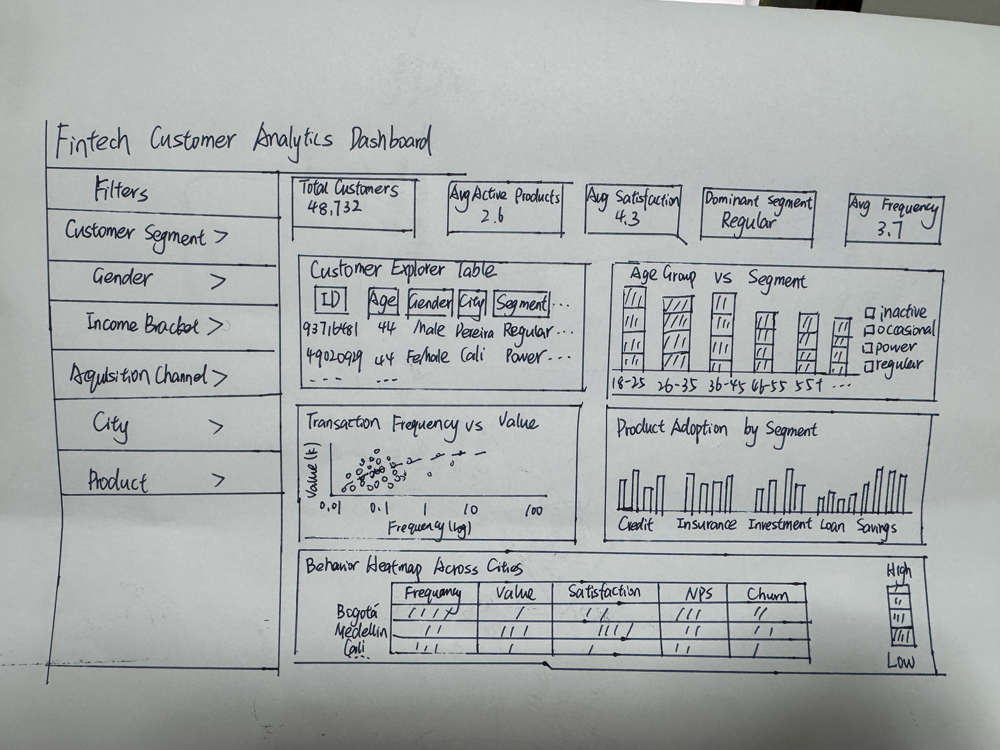
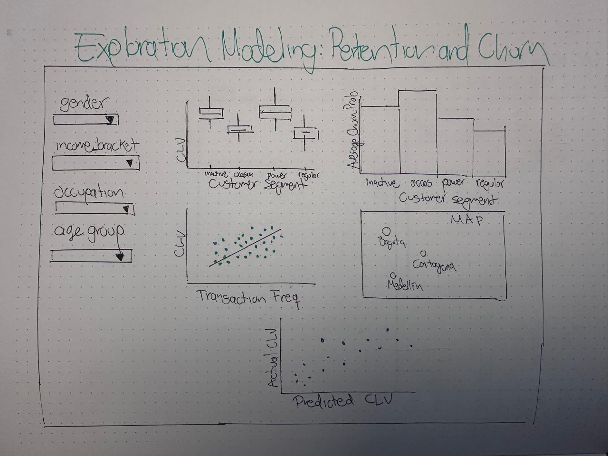

# Motivation

The rapid growth of fintech platforms has generated rich customer-level data spanning demographics, product adoption, digital behaviour, and service experience. Yet many business and product teams still rely on static spreadsheets or disconnected dashboards that fail to surface actionable insights.

**COFINFAD** (*Colombian Fintech Financial Analytics Dataset*) provides a unique opportunity to bridge this gap. With **57 customer-level features**, covering demographics, transaction behaviour, satisfaction scores, NPS, churn probability, and customer lifetime value (CLV), this dataset is well-suited for an end-to-end interactive analytics application.

This project proposes the development of a **Web-enabled Visual Analytics Application** using R Shiny that allows business users to:

-   Understand **who their customers are** across demographic and geographic dimensions
-   Examine **how customers engage** with the platform and experience its services
-   Identify **which customers are at risk of churning** and which generate the highest long-term value
-   Detect **high-value customers** with strong lifetime value potential

The system follows a **progressive analytics workflow**, guiding users from broad customer population insights toward deeper behavioural analysis and retention risk assessment.

------------------------------------------------------------------------

# Objectives

The core objective of this project is to design and develop a **three-module visual analytics system** that answers key business questions about fintech customers.

| Module | Key Questions |
|------------------------------------|------------------------------------|
| **Module 1: Customer Overview & Segmentation** | Who are our customers? Which segments and acquisition channels dominate the platform? |
| **Module 2: Customer Engagement & Experience** | How active are customers? What drives satisfaction? What complaints arise? |
| **Module 3: Retention Risk & Customer Value** | Which customers are at risk of churn? Which customers generate the highest lifetime value? |

Together, the modules form a complete analytical workflow:

```         
Customer Structure
       ↓
Customer Engagement & Experience
       ↓
Customer Retention & Business Value
```

------------------------------------------------------------------------

# Data

## Dataset Overview

The primary dataset is the **COFINFAD Customer Dataset**, a single tabular file with **57 features** covering multiple analytical dimensions.

```{r}
#| label: data-preview
library(tidyverse)
library(readxl)

customer <- readxl::read_xlsx("../data/customer_data.xlsx")

cat(sprintf("Dataset: %d rows × %d columns\n", nrow(customer), ncol(customer)))
col_map <- tribble(
  ~Variable,                    ~Category,
  "age",                        "Demographics",
  "gender",                     "Demographics",
  "city",                       "Demographics",
  "department",                 "Demographics",
  "income_bracket",             "Demographics",
  "occupation",                 "Demographics",
  "education_level",            "Demographics",
  "marital_status",             "Demographics",
  "household_size",             "Demographics",
  "latitude",                   "Demographics",
  "longitude",                  "Demographics",
  "savings_account",            "Product Adoption",
  "credit_card",                "Product Adoption",
  "personal_loan",              "Product Adoption",
  "investment_account",         "Product Adoption",
  "insurance_product",          "Product Adoption",
  "active_products",            "Product Adoption",
  "customer_segment",           "Product Adoption",
  "acquisition_channel",        "Product Adoption",
  "app_logins_frequency",       "Digital Engagement",
  "feature_usage_diversity",    "Digital Engagement",
  "bill_payment_user",          "Digital Engagement",
  "auto_savings_enabled",       "Digital Engagement",
  "credit_utilization_ratio",   "Digital Engagement",
  "international_transactions", "Digital Engagement",
  "failed_transactions",        "Digital Engagement",
  "base_satisfaction",          "Satisfaction & Feedback",
  "tx_satisfaction",            "Satisfaction & Feedback",
  "product_satisfaction",       "Satisfaction & Feedback",
  "satisfaction_score",         "Satisfaction & Feedback",
  "nps_score",                  "Satisfaction & Feedback",
  "support_tickets_count",      "Satisfaction & Feedback",
  "resolved_tickets_ratio",     "Satisfaction & Feedback",
  "app_store_rating",           "Satisfaction & Feedback",
  "feedback_sentiment",         "Satisfaction & Feedback",
  "feature_requests",           "Satisfaction & Feedback",
  "complaint_topics",           "Satisfaction & Feedback",
  "last_survey_date",           "Satisfaction & Feedback",
  "tx_count",                   "Transaction Behaviour",
  "avg_tx_value",               "Transaction Behaviour",
  "total_tx_volume",            "Transaction Behaviour",
  "monthly_transaction_count",  "Transaction Behaviour",
  "average_transaction_value",  "Transaction Behaviour",
  "total_transaction_volume",   "Transaction Behaviour",
  "transaction_frequency",      "Transaction Behaviour",
  "weekend_transaction_ratio",  "Transaction Behaviour",
  "avg_daily_transactions",     "Transaction Behaviour",
  "preferred_transaction_type", "Transaction Behaviour",
  "first_tx",                   "Transaction Behaviour",
  "last_tx",                    "Transaction Behaviour",
  "first_transaction_date",     "Transaction Behaviour",
  "last_transaction_date",      "Transaction Behaviour",
  "churn_probability",          "Retention & Value",
  "customer_lifetime_value",    "Retention & Value",
  "clv_segment",                "Retention & Value",
  "customer_tenure",            "Retention & Value")
col_map |>
  count(Category, name = "Feature Count") |>
  knitr::kable(caption = "Feature Distribution Across Analytical Dimensions")
```

```{r}
#| label: data-glimpse
customer |>
  select(age, gender, customer_segment, income_bracket,
         satisfaction_score, nps_score, churn_probability,
         customer_lifetime_value, clv_segment) |>
  slice_head(n = 5) |>
  knitr::kable(caption = "Sample Rows — Key Variables Across All Three Modules")
```

## Data Preparation Notes

Before analysis, several data cleaning and validation steps will be performed:

1.  **Remove exact duplicate fields**: `first_tx` duplicates `first_transaction_date`; `last_tx` duplicates `last_transaction_date`. The more descriptive names will be retained.

2.  **Audit overlapping transaction summary variables**: The pairs `avg_tx_value` & `average_transaction_value` and `total_tx_volume` & `total_transaction_volume` are redundant. One from each pair will be retained after validation.

3.  **Handle missing values** separately for:

    -   `complaint_topics` : likely missing when no complaint was filed, recode as `"None"`
    -   `feature_requests` : treat NA as no request, recode as `"None"`
    -   `credit_utilization_ratio` : impute or flag depending on credit card ownership

4.  **Convert date**: Columns (`first_transaction_date`, `last_transaction_date`, `last_survey_date`) will be converted to proper `Date` format using `lubridate`.

5.  **Categorical standardisation**: Standardise categorical levels for demographic, feedback, and product-related variables using `forcats::fct_relevel()`.

6.  **Outlier validation**: Validate continuous variables for outliers using IQR fencing for `churn_probability`, `customer_lifetime_value`, and transaction volume variables.

7.  **Cross-field consistency checks**: Verify that `customer_tenure` aligns with `first_transaction_date`; confirm `active_products` count is consistent with binary product ownership columns.

------------------------------------------------------------------------

# Methodology

The application uses a **layered visual analytics** approach, structured around three analytical modules. Each module is designed to answer progressively deeper questions about the customer base.

## Module 1 — Customer Overview & Segmentation

```{r}
#| label: tbl-module1-viz
#| tbl-cap: "Module 1 – Proposed Visualisations"
tibble::tribble(
  ~Chart, ~Type, ~Key_Variables,
  "Customer Segment Distribution by Age Group",
  "Stacked Bar Chart",
  "age_group, customer_segment",

  "Transaction Frequency by Age & Segment",
  "Boxplot",
  "age_group, transaction_frequency, customer_segment",

  "Transaction Frequency vs Value",
  "Scatter Plot",
  "transaction_frequency, average_transaction_value",

  "Financial Product Adoption by Segment",
  "Grouped Bar Chart",
  "customer_segment, savings_account, credit_card, personal_loan, investment_account, insurance_product",

  "Behaviour Heatmap Across Cities",
  "Heatmap",
  "city, transaction_frequency, avg_daily_transactions, average_transaction_value, app_logins_frequency, satisfaction_score, nps_score, churn_probability"
) |>
  knitr::kable(
    align = "lcc")
```

**Filters**: `customer_segment`, `gender`, `income_bracket`, `acquisition_channel`, `city`, `product`

**Objective**: Provide a comprehensive overview of the customer population and identify key demographic and behavioural segments.

------------------------------------------------------------------------

## Module 2 — Customer Engagement & Experience

```{r}
#| label: tbl-module2-viz
#| tbl-cap: "Module 2 — Proposed Visualisations"

tibble::tribble(
  ~Chart, ~Type, ~Key_Variables,
  "App Login Frequency by Segment",  "Boxplot",      "app_logins_frequency, customer_segment",
  "Satisfaction Score by Segment",   "Boxplot",      "satisfaction_score, customer_segment",
  "Complaint Topics Distribution",   "Bar Chart",    "complaint_topics",
  "Support Tickets vs Satisfaction", "Scatter Plot", "support_tickets_count, satisfaction_score"
) |>
  knitr::kable()
```

**Filters**: `customer_segment`, `feedback_sentiment`, `complaint_topics`, `acquisition_channel`, `product`

**Objective**: Analyse how customers interact with the platform and evaluate their service experience.

------------------------------------------------------------------------

## Module 3 — Retention Risk & Customer Value

```{r}
#| label: tbl-module3-viz
#| tbl-cap: "Module 3 — Proposed Visualisations"

tibble::tribble(
  ~Chart, ~Type, ~Key_Variables,
  "CLV by Customer Segment",      "Boxplot",      "customer_lifetime_value, customer_segment",
  "Average Churn Probability by Segment", "Bar Chart", "churn_probability, customer_segment",
  "CLV vs Transaction Frequency", "Scatter Plot", "customer_lifetime_value, transaction_frequency",
  "Actual vs Predicted CLV",      "Scatter Plot", "customer_lifetime_value (actual), predicted_clv",
  "Geographic CLV Map",           "Map",          "latitude, longitude, customer_lifetime_value"
) |>
  knitr::kable(
    align = "lcc"
  )
```

**Filters**: `gender`, `income_bracket`, `occupation`, `age_group`

**Objective**: Identify high-value customers and detect groups at higher churn risk.

------------------------------------------------------------------------

# Prototype Sketches

## Module 1 — Customer Overview & Segmentation



## Module 2 — Customer Engagement & Experience


## Module 3 — Retention Risk & Customer Value



------------------------------------------------------------------------

# R Packages

The following R packages are required for this project. All packages are available on CRAN.

```{r}
#| label: packages-table
tibble::tribble(
  ~Package,        ~Purpose,
  "tidyverse",     "Core data manipulation and transformation",
  "readxl",        "Importing Excel data files",
  "dplyr",         "Filtering, grouping, and aggregation",
  "ggplot2",       "Static visualisation layer",
  "plotly",        "Interactive charts (hover, zoom, filter)",
  "forcats",       "Handling and reordering categorical variables",
  "scales",        "Formatting axes with percentages and currency",
  "ggdist",        "Distribution and uncertainty visualisation",
  "patchwork",     "Composing multiple ggplot2 panels",
  "lubridate",     "Parsing and transforming date columns",
  "heatmaply",     "Interactive clustering heatmaps",
  "viridis",       "Colour scales for heatmaps and continuous data",
  "leaflet",       "Interactive geographic maps",
  "cluster",       "Clustering algorithms for segmentation analysis",
  "DT",            "Interactive data tables",
  "shiny",         "Web application framework",
  "shinydashboard","Dashboard layout and UI components",
  "bslib",         "Modern Bootstrap themes for Shiny UI"
) |>
  knitr::kable(caption = "Required R Packages")
```

------------------------------------------------------------------------

# Project Schedule

```{r}
#| label: schedule-gantt
#| fig-width: 10
#| fig-height: 5

library(tidyverse)
library(lubridate)
proposal_deadline <- ymd("2026-03-18")
schedule <- tribble(
  ~task, ~start, ~end,
  "Project Proposal", "2026-03-01", "2026-03-18",
  "Data Cleaning & EDA", "2026-03-01", "2026-03-10",
  "Module 1 Prototype", "2026-03-18", "2026-03-23",
  "Module 2 Prototype", "2026-03-18", "2026-03-23",
  "Module 3 Prototype", "2026-03-18", "2026-03-23",
  "Shiny App Development", "2026-03-23", "2026-03-30",
  "Project Website (Quarto)", "2026-03-25", "2026-03-31",
  "Poster Preparation", "2026-03-30", "2026-04-04",
  "User Guide", "2026-04-02", "2026-04-04",
  "Final Submission", "2026-04-05", "2026-04-05")
schedule <- schedule %>%
  mutate(
    start = ymd(start),
    end = ymd(end),
    status = ifelse(end <= proposal_deadline,
                    "Completed",
                    "To be done"),
    task = factor(task, levels = rev(task))
  )

ggplot(schedule) +
  geom_segment(
    aes(x = start,
        xend = end,
        y = task,
        yend = task,
        colour = status),
    linewidth = 8
  ) +
  scale_colour_manual(
    values = c(
      "Completed" = "#9BD3E8",
      "To be done" = "#F4A6B0")) +
 scale_x_date(
    date_breaks = "1 week",
    date_labels = "%b %d") +
 labs(
    title = "Project Timeline",
    x = "Date",
    y = "",
    colour = "") +
 theme_minimal(base_size = 13) +
  theme(
    legend.position = "top",
    panel.grid.minor = element_blank())
```

| Milestone                   | Deadline               |
|-----------------------------|------------------------|
| Project Proposal on Netlify | 18 March 2026, 11:59pm |
| Poster Submission           | 1 April 2026, 11:59pm  |
| Poster Presentation         | 4 April 2026           |
| Final Submission            | 5 April 2026, 11:59pm  |
